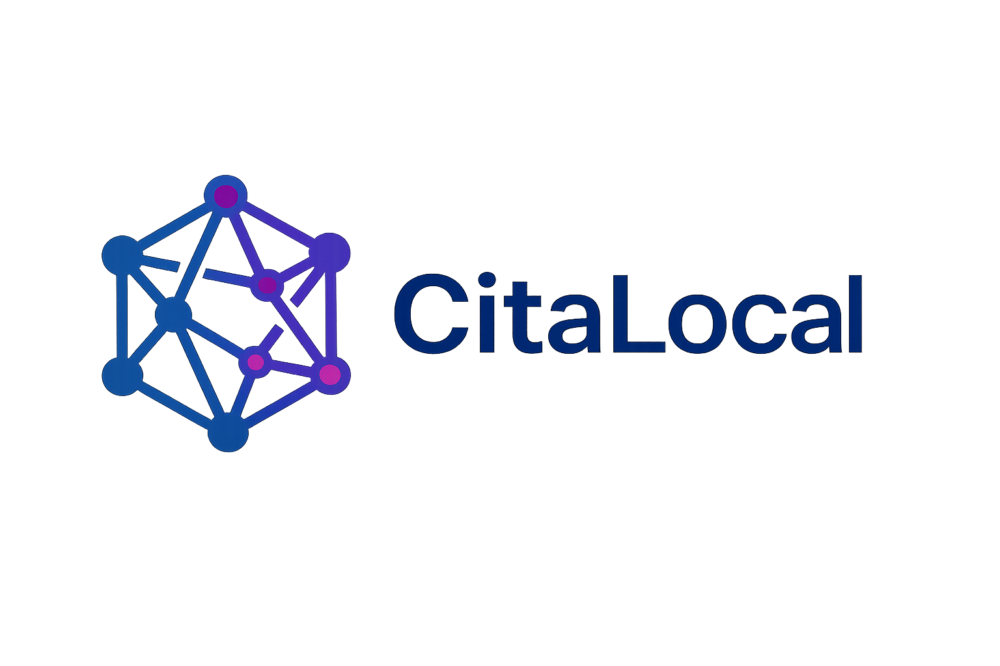

  

  <strong>Búsqueda y síntesis local de literatura científica, con IA 100% privada</strong>

  <a href="#instalación">Instalación</a> •
  <a href="#uso">Uso</a> •
  <a href="#características">Características</a> •
  <a href="#licencia">Licencia</a> •
  <a href="#apoya-el-proyecto">Apoya el proyecto</a>

  
  

---

## ¿Qué es CitaLocal?

**CitaLocal** es una herramienta de escritorio gratuita y de código abierto que permite:

- 🔍 Buscar literatura científica simultáneamente en **8 bases de datos abiertas**
- 🧠 Generar resúmenes y síntesis narrativas usando **IA local** (Ollama), sin enviar tus datos a servidores externos
- 📄 Exportar resultados en formatos listos para usar: **CSV, RIS (Zotero), BibTeX, Word, Markdown**
- 🔒 Funciona completamente **sin conexión a servicios de pago** y sin necesidad de suscripciones de IA

Ideal para investigadores, estudiantes de posgrado y redactores de artículos científicos que necesitan explorar el estado del arte de un tema rápidamente y de forma privada.

Desarrollado por [Claudio Bernal](https://bernaljoseclaudio.github.io/claudiobernal/).

---

## Características

| Función | Descripción |
|---|---|
| Búsqueda multi-fuente | PubMed, Europe PMC, Crossref, Semantic Scholar, DOAJ/MDPI, OpenAlex, arXiv, CORE |
| Filtros | Por año de publicación, cantidad de resultados por fuente |
| Resúmenes automáticos | Generados localmente con Ollama, sin costo por token |
| Síntesis IMRAD | Análisis narrativo estructurado (Introducción, Métodos, Resultados, Discusión) de toda la literatura encontrada |
| Exportación | `.csv`, `.ris`, `.bib`, `.md`, `.txt`, `.docx` |
| Historial local | Búsquedas anteriores guardadas automáticamente, recuperables con un clic |
| 100% privado | Ningún dato ni consulta se envía a servidores de terceros para el análisis de IA |

---

## Requisitos

- **Sistema operativo:** Ubuntu/Linux (probado) o Windows
- **Python 3.10 o superior**
- **[Ollama](https://ollama.com)** instalado y corriendo
- Al menos un modelo de IA descargado en Ollama (recomendado: `phi3:mini` o `llama3.2:3b`)
- Conexión a internet (solo para las búsquedas en bases de datos; el análisis con IA es 100% local)

---

## Instalación

### Linux (Ubuntu/Debian)

Clona el repositorio y ejecuta el instalador automático:

    git clone https://github.com/bernaljoseclaudio/citalocal.git
    cd citalocal
    chmod +x instalar.sh
    ./instalar.sh

El script se encarga de:
- Crear el entorno virtual de Python
- Instalar todas las dependencias necesarias
- Verificar si Ollama está instalado (si no, indica cómo instalarlo)
- Descargar un modelo de IA recomendado si no tienes ninguno

### Windows

Clona el repositorio (requiere Git para Windows) y ejecuta el instalador:

    git clone https://github.com/bernaljoseclaudio/citalocal.git
    cd citalocal
    instalar.bat

### Instalar Ollama (si no lo tienes)

- Linux: `curl -fsSL https://ollama.com/install.sh | sh`
- Windows/Mac: descarga desde [ollama.com/download](https://ollama.com/download)

Luego descarga al menos un modelo:

    ollama pull phi3:mini

---

## Uso

### Iniciar la aplicación

**Linux:** doble clic en el ícono de escritorio, o desde terminal:

    ./iniciar.sh

**Windows:** doble clic en `iniciar.bat`

Esto abrirá automáticamente tu navegador en `http://localhost:8501` con la interfaz de CitaLocal.

### Flujo de trabajo típico

1. Escribe tu tema de búsqueda en el panel izquierdo
2. Ajusta el rango de años y las fuentes a consultar
3. Presiona **Buscar**
4. Revisa la tabla de resultados y descarga en el formato que necesites
5. Presiona **Generar análisis IMRAD** para obtener una síntesis narrativa de toda la literatura
6. Descarga el análisis en Word, Markdown o texto plano

> **Nota sobre el formato de la síntesis:** el resultado (párrafos narrativos vs. viñetas) depende del modelo de IA elegido. Modelos más grandes (ej. `llama3.2:3b` o superiores) siguen mejor las instrucciones de redacción en prosa. Modelos pequeños (ej. `phi3:mini`) tienden a producir listas incluso cuando se les pide texto narrativo. Puedes ajustar esto en "Opciones avanzadas de redacción".

---

## Fuentes de datos utilizadas

Todas las fuentes integradas en CitaLocal son de **acceso abierto y uso gratuito**, sin restricciones comerciales:

- [PubMed](https://pubmed.ncbi.nlm.nih.gov/) (NCBI)
- [Europe PMC](https://europepmc.org/)
- [Crossref](https://www.crossref.org/)
- [Semantic Scholar](https://www.semanticscholar.org/)
- [DOAJ](https://doaj.org/) (incluye cobertura de MDPI y otras revistas Open Access)
- [OpenAlex](https://openalex.org/)
- [arXiv](https://arxiv.org/)
- [CORE](https://core.ac.uk/) (requiere API key gratuita, ver configuración abajo)

> CitaLocal **no incluye** integraciones con bases de datos de pago o de scraping no autorizado (ej. Google Scholar, Elsevier, Springer directamente), para mantener el proyecto legalmente seguro y 100% redistribuible.

---

## Configuración opcional (API keys gratuitas)

Algunas fuentes mejoran su funcionamiento con una clave gratuita. Agrega estas líneas a tu archivo `~/.bashrc` (Linux):

    export CORE_API_KEY="tu_clave_aqui"
    export OPENALEX_EMAIL="tu_correo@ejemplo.com"
    export NCBI_API_KEY="tu_clave_aqui"

Luego ejecuta `source ~/.bashrc` para aplicar los cambios.

- **CORE_API_KEY**: obligatoria para esta fuente específica, gratis en [core.ac.uk](https://core.ac.uk/services/api)
- **OPENALEX_EMAIL**: opcional, prioriza tus consultas en OpenAlex
- **NCBI_API_KEY**: opcional, sube el límite de consultas en PubMed

---

## Estructura del proyecto

    citalocal/
    ├── app.py              (Interfaz visual con Streamlit)
    ├── core.py             (Motor de búsqueda, IA y exportación)
    ├── branding.py         (Configuración de marca: logo, colores)
    ├── literatura.py       (Versión de línea de comandos)
    ├── requirements.txt    (Dependencias de Python)
    ├── instalar.sh/.bat    (Instaladores automáticos)
    ├── iniciar.sh/.bat     (Inicio rápido de la app)
    └── assets/             (Logo e íconos)

---

## Licencia

Este proyecto se distribuye bajo la licencia **GNU GPLv3**. Esto significa que puedes usarlo, modificarlo y redistribuirlo libremente, siempre que cualquier versión modificada también se mantenga bajo la misma licencia abierta. Ver el archivo `LICENSE` para más detalles.

---

## Apoya el proyecto

CitaLocal es gratuito y lo seguirá siendo. Si te resulta útil y quieres apoyar su desarrollo:

- ☕ Buy Me a Coffee: https://buymeacoffee.com/jbnen3
- 💛 Ko-fi: https://ko-fi.com/jbnen3

---

## Aviso legal

CitaLocal es una herramienta de apoyo a la investigación. No reemplaza el juicio crítico del investigador: **siempre verifica la información y las citas generadas contra las fuentes originales** antes de usarlas en publicaciones académicas.

---

## Autor

**Claudio Bernal**
Portfolio: https://bernaljoseclaudio.github.io/claudiobernal/
GitHub: https://github.com/bernaljoseclaudio

---

## Contribuciones

Las contribuciones son bienvenidas. Si encuentras un error o tienes una idea de mejora, abre un Issue o envía un Pull Request en el repositorio de GitHub.